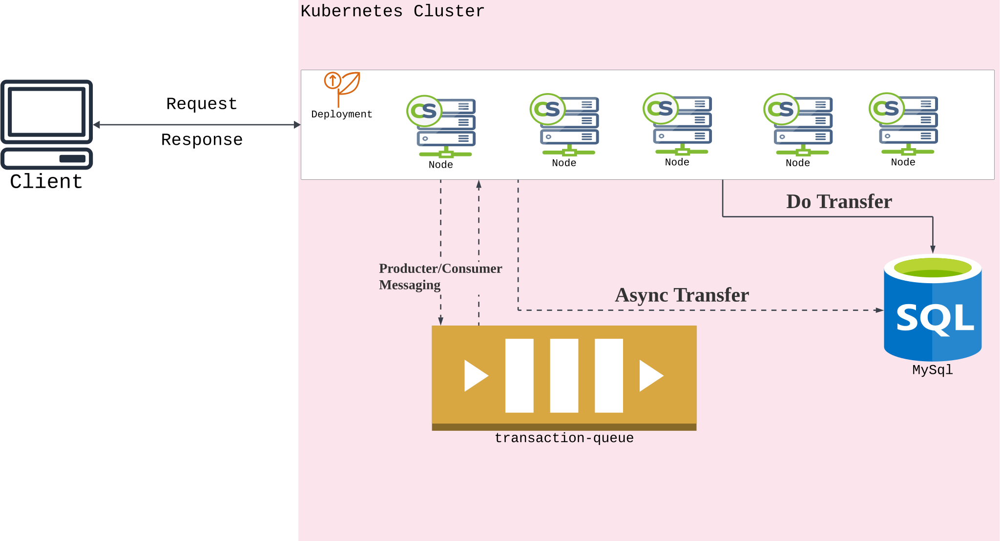
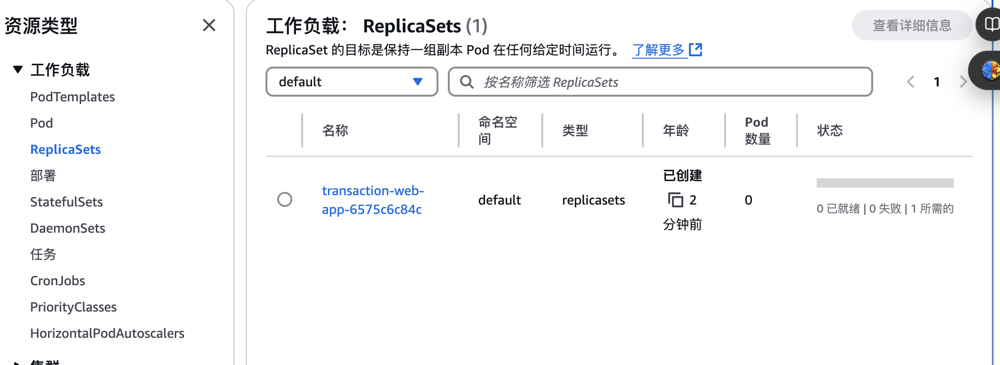

# Transaction Service

## 1. 整体架构

本项目是一个基于 Spring Boot 的微服务应用，旨在实现用户账户管理和交易处理等核心功能。系统采用分层架构设计，通过 K8S 集群部署，实现动态扩容从而达到高效的处理，主要包括以下模块：

- **账户模块**：处理用户账户的查询和更新操作。
- **交易模块**：管理用户的存款、取款和转账等交易操作。
- **消息队列模块**：通过 RabbitMQ 实现异步消息处理，确保系统的高性能和可扩展性。

下图展示了系统的整体架构：


架构图中展示了各模块之间的交互关系，以及与 MySQL 和 RabbitMQ 等外部组件的集成方式。

## 2. Service 实现

### a. 依赖的组件

- **MySQL**：作为系统数据库，用于存储账户信息和交易记录等关键数据。
- **RabbitMQ**：作为消息队列中间件，在请求量过大的时候，通过异步处理的形式支持转账等一系列业务，提升系统的响应速度和可扩展性。

### b. 主要接口

以下是系统中主要的 RESTful API 接口及其功能描述：

1. **用户注册**

   - **URL**：`POST http://{service-endpoint}/api/account/register`
   - **请求体**：

     ```json
     {
       "UserName": "example_user",
       "FirstName": "first_name",
       "LastName": "last_name"
     }
     ```

   - **功能**：创建新用户账户。

2. **查询用户信息**

   - **URL**：`GET http://{service-endpoint}/api/account/{userId}`

   - **功能**：查询全部或指定用户的基本信息以及余额。

3. **存款操作**

   - **URL**：`POST http://{service-endpoint}/api/transaction/deposit`
   - **请求体**：

     ```json
     {
       "UserId": "USER-2DBB8F6D1DA44259B379457B823",
       "Amount": 20.0
     }
     ```

   - **功能**：为指定用户的账户增加余额。

4. **取款操作**

   - **URL**：`POST http://{service-endpoint}/api/transaction/withdraw`
   - **请求体**：

     ```json
     {
       "UserId": "USER-2DBB8F6D1DA44259B379457B823",
       "Amount": 10.0
     }
     ```

   - **功能**：从指定用户的账户中扣减余额。

5. **转账操作**

   - **URL**：`POST http://{service-endpoint}/api/transaction/transfer`
   - **请求体**：

     ```json
     {
       "SourceUserId": "USER-2DBB8F6D1DA44259B379457B823",
       "DestUserId": "USER-3ACB9F7E2EB54368A480567C934",
       "Amount": 50.0
     }
     ```

   - **功能**：在两个用户的账户之间进行余额转移。

### c. 动态扩容与配置方案

为确保系统的高可用性和可扩展性，提供以下两种方案：

1. **Kubernetes 动态扩容**

   通过将应用部署在 Kubernetes（K8S）集群上，利用其自动伸缩功能，根据系统负载情况自动调整服务实例数量，确保在高并发场景下的稳定性。

2. **RabbitMQ 异步处理**

   利用 RabbitMQ 的消息队列机制，将耗时的操作（如转账交易）以异步方式执行，减少系统的响应时间，提高吞吐量。

## 3. 服务的部署与配置

1. **环境准备**

   - 安装并配置 Docker，用于容器化应用。
   - 安装并配置 Kubernetes 集群，确保集群正常运行。
   - 确保已配置 MySQL 和 RabbitMQ 服务。
   - 以 AWS 为例，需要创建 AWS EKS 集群，AWS ECR 仓库，已经 AWS 提供的 RDS-MySql 和 AWS Amazon MQ

2. **输入相关配置**

   - 确保已经登入并配置 aws cli 已经 kubectl

   - 在文件 ./main/resources/application-prod.properties 中填入已配置好的 MySql 和 RabbitMQ 的域名、端口、登录信息

   - 在文件 ./deploy.sh 中填入相关的 aws 用户信息

3. **运行部署脚本**

   - 在项目根目录运行相关脚本并观察输出：

     ```bash
     sh ./deploy.sh
     ```
  - 运行成功后会有对应的service和deployment，如图
  
  
4. **通过 Postman 进行接口测试**

## 4. To Do List

- **集成 ExceptionHandler**

  由于时间所限，需要集成 ExceptionHandler，使请求处理出错时返回规范的 Response

- **部署上线之后对系统进行压测**

  对系统进行压测并记录数据，以便后续配置动态扩容。

- **集成 JUnit 单元测试**

  集成单元测试，保证每次上线功能不受影响，业务保证一致性。

- **完善日志记录功能**

  集成日志框架，如 Kafka，ElasticSearch-Kibana 等，记录系统运行情况和错误信息，以便后续分析处理

- **集成服务指标上报以及服务预警响应**

  集成 Prometheus，使部署在 K8S 上的 deployment 进行指标上报，并集成 Grafana 形成看板，在服务受到影响以及不可用时能及时收到相关预警并快速响应。
  ::contentReference[oaicite:0]{index=0}
